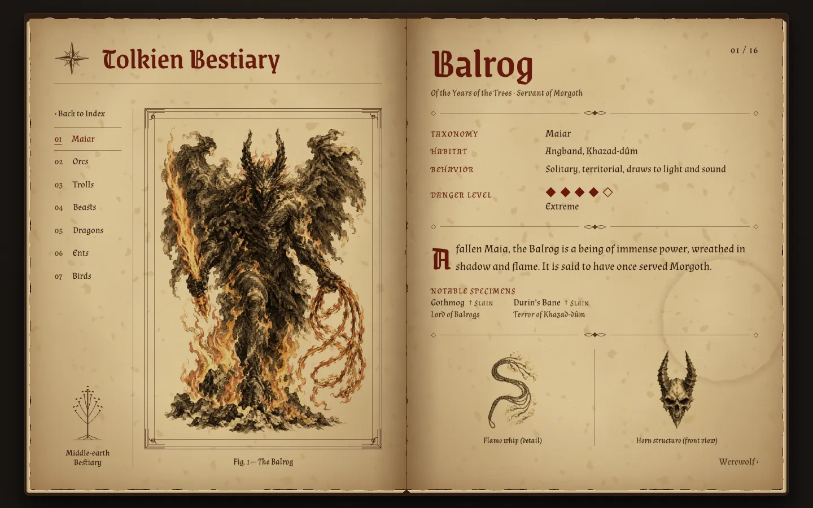

# 🗡️ Tolkien Bestiary

[](https://github.com/xfactor107/middle-earth-bestiary/actions/workflows/test.yml)

An illustrated codex of the creatures of Middle-earth, presented as an aged manuscript that a scholar like Gandalf might have studied. Turn its pages to read of Balrogs, dragons, Ents and the other beasts of Tolkien's legendarium.



---

## 🌟 Features

- **An open-book codex:** a two-page spread on aged parchment, with foxing, stains, deckled edges and ink that soaks into the paper. The textures are all generated in code, so there are no texture images to load.
- **16 entries in 7 chapters:** Maiar, Orcs, Trolls, Beasts, Dragons, Ents and Birds. Each entry lists the creature's taxonomy, habitats, behavior, danger rating, lineage and notable specimens (Gothmog, Smaug, Treebeard and others).
- **Engraved plates:** original illustrations in a 17th-century natural-history style, blended into the page like ink.
- **Search:** filter the contents by name, chapter, habitat, notable specimen and more. Accents don't matter, and each search has its own shareable URL.
- **Page turning:** a 3D page-turn animation as you move through the book, using prev/next links, the ← → arrow keys or a swipe on touch screens. It falls back to a plain page switch where the browser lacks View Transitions or the reader prefers reduced motion.
- **Responsive:** the book fits the window on desktop and stacks into a single page on tablets and phones.

---

## 🛠️ Tech Stack

**Frontend** (`frontend/`)

- React 19 + TypeScript, built with Vite
- React Router for the contents page (`/`) and entry pages (`/creatures/:id`)
- Hand-written CSS with no UI library, plus SVG ornaments and filters
- sharp, for the artwork optimization script

**Backend** (`backend/`)

- Node.js + Express 5 + TypeScript
- PostgreSQL (hosted on Neon) through the Prisma ORM
- Zod request validation
- REST API; write routes are protected by an API key

---

## 🚀 Getting Started

### Prerequisites

- [Node.js](https://nodejs.org/) 20.19+ or 22.12+
- A PostgreSQL database: a free [Neon](https://neon.tech/) project, or a local PostgreSQL 14+
- [Git](https://git-scm.com/)

### 1. Clone the repository

```bash
git clone https://github.com/xfactor107/middle-earth-bestiary.git
cd middle-earth-bestiary
```

### 2. Start the backend

```bash
cd backend
npm install
cp .env.example .env        # then set DATABASE_URL (see below)
npm run migrate:deploy      # create the tables
npm run seed                # write the 16 bestiary entries
npm run dev                 # API on http://localhost:3000
```

### 3. Start the frontend

In a second terminal:

```bash
cd frontend
npm install
npm run dev                 # app on http://localhost:5173
```

During development, Vite forwards `/api` requests to the backend on port 3000, so the frontend needs no configuration.

---

## ⚙️ Environment Variables

**`backend/.env`**

| Variable | Required | Purpose |
|---|---|---|
| `DATABASE_URL` | Yes | PostgreSQL connection string. Use Neon's **direct** connection (the host without `-pooler`) wherever migrations run: through the pooler, Prisma's migration lock can get stuck and later migrations fail with `P1002`. |
| `PORT` | No | Port for the API (default `3000`) |
| `ADMIN_API_KEY` | No | Secret needed for `POST`/`PUT`/`DELETE`. If unset, writes are disabled. |
| `CORS_ORIGIN` | No | Comma-separated list of allowed origins, e.g. `https://your-app.vercel.app`. If unset, any origin is allowed. |

**`frontend/.env`**

| Variable | Required | Purpose |
|---|---|---|
| `VITE_API_URL` | In production | Base URL of the deployed API. Leave unset in development. |

---

## 📜 API

Base path: `/api/creatures`

| Method | Route | Description |
|---|---|---|
| `GET` | `/` | Lists creatures with their habitats and notables. Results are paginated. |
| `GET` | `/:id` | Returns one creature. |
| `POST` | `/` | Creates a creature. Requires the `x-api-key` header. |
| `PUT` | `/:id` | Updates a creature. Requires the `x-api-key` header. |
| `DELETE` | `/:id` | Deletes a creature. Requires the `x-api-key` header. |

**Query parameters for `GET /`:** `search`, `category` (`MAIAR`, `ORCS`, `TROLLS`, `BEASTS`, `DRAGONS`, `ENTS`, `BIRDS`), `habitat`, `originEra`, `taxonomy`, `dangerRating` (1–5), `page`, `limit` (max 50), `sortBy` (`category`, `name`, `dangerRating`, `createdAt`) and `order` (`asc` or `desc`).

The default sort is codex order: by chapter, then by name. A creature's page number in the book is its position in that order.

```bash
curl "http://localhost:3000/api/creatures?category=DRAGONS"
curl -X DELETE -H "x-api-key: $ADMIN_API_KEY" http://localhost:3000/api/creatures/42
```

---

## 🧪 Testing

Both apps have fast, offline test suites (Vitest):

```bash
cd backend && npm test    # API: routes, validation, API-key protection, errors, CORS
cd frontend && npm test   # search matching, chapter grouping, retry while the backend wakes
```

The backend tests replace the database with a mock, so they never touch real data. GitHub Actions runs both suites, plus lint and a production build, on every push to `main`.

---

## ✍️ Editing the Codex

All entries are defined in [`backend/prisma/bestiary.ts`](backend/prisma/bestiary.ts). To add or change a creature, edit that file, then run:

```bash
cd backend && npm run seed
```

The seed can be run any number of times. Each run updates the database to match the file without creating duplicates.

## 🎨 Adding Artwork

Each entry has one plate and two sketches. Their file names are set in `bestiary.ts`, e.g. `werewolf-plate`, `werewolf-jaw` and `werewolf-paw`.

1. Put the full-size image in `frontend/art-originals/` with the matching name, e.g. `werewolf-jaw.png`. This folder is not committed to git.
2. Run the optimization script:

   ```bash
   cd frontend && npm run art
   ```

   This writes a resized WebP to `frontend/public/images/`, typically cutting a 3 MB PNG to about 250 KB. Commit only the WebP.

Draw the art on a plain white background, with no border and no paper texture. The page supplies the parchment and the frame, and blends the white areas away.

---

## ☁️ Deployment

- **Backend on [Render](https://render.com/):**
  - Root directory: `backend`
  - Build command: `npm install && npm run build && npm run migrate:deploy`
  - Start command: `npm start`
  - Environment variables: `DATABASE_URL`, `CORS_ORIGIN`, and `ADMIN_API_KEY` if you need write access.
- **Frontend on [Vercel](https://vercel.com/):**
  - Root directory: `frontend`
  - Environment variable: set `VITE_API_URL` to the Render URL.
  - The included `vercel.json` makes direct links like `/creatures/7` load correctly.

---

## 📖 Disclaimer

This is a non-commercial fan project and is not affiliated with or endorsed by the Tolkien Estate, Middle-earth Enterprises, or any film studio. Creature descriptions are written in our own words, and all illustrations are original works.
